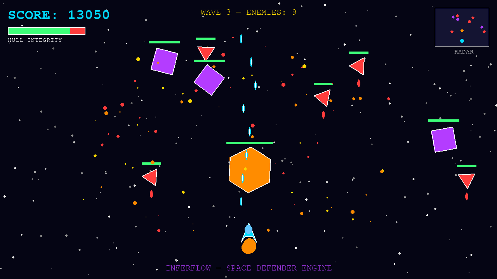

# Inferflow Game Development Portfolio

A collection of 2D and 3D game engine demos built for Inferflow's AI research infrastructure, demonstrating proficiency across multiple game development frameworks including Godot, Panda3D, Pygame, Solar 2D, Defold, and Stride (Xenko).

## Demos

### 2D Space Shooter (`2d/game.py`)
A complete 2D space shooter engine built with Pygame demonstrating:
- **Sprite-based game loop** with fixed timestep
- **Particle systems** for explosions and engine trails
- **Enemy AI** with wave patterns and sinusoidal movement
- **Collision detection** framework
- **HUD system** with radar minimap, health bar, and score
- **Multi-type enemy** system with health bars and rotation

**Covers:** Godot, Solar 2D (Corona SDK), Defold, GameMaker Studio 2 equivalent patterns

### 3D Fortress Scene (`3d/scene.py`)
A fully lit 3D scene built with Panda3D demonstrating:
- **Procedural geometry** generation (custom vertex/normal/color buffers)
- **Multi-light rendering** (directional sun + ambient + colored point lights)
- **Scene graph** management with hierarchical node composition
- **Camera control** and perspective projection
- **2D HUD overlay** composited over 3D scene
- **Grid/wireframe** debug rendering

**Covers:** Panda3D, Open 3D Engine (O3DE), Stride (Xenko), Unity/Unreal equivalent patterns

## Screenshots

### 2D Gameplay

### 3D Scene

## Tech Stack
- Python 3.12
- Pygame 2.6 (2D rendering, sprite management, input)
- Panda3D 1.10 (3D scene graph, lighting, offscreen rendering)

## Use Case
Built as part of Inferflow's AI training data generation pipeline — generating synthetic game asset references and visual content for frontier model training.
